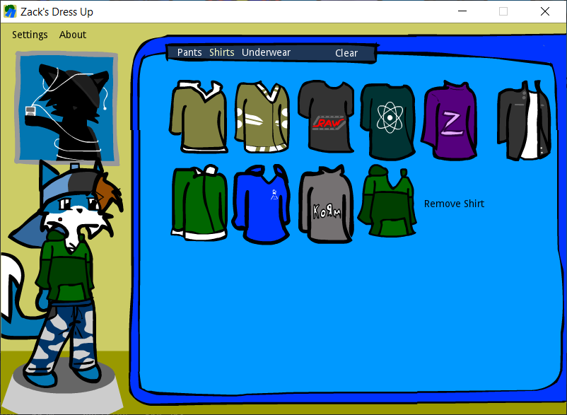

# Dress Up Zack



Dress Up Zack is a port of my first (and only) Flash game series developed back in 2007 and was heavily inspired by The Sims 2: Body Shop. This new version keeps the same assets while streamlining the gameplay.

## 🏗️ Built With

- [Godot 4.5](https://godotengine.org/)

## 📅 Support Model

| Patch Type           | Timeline                  |
| -------------------- | ------------------------- |
| Critical Hotfixes    | 1-2 weeks after discovery |
| Minor Bugfix Patches | Monthly or as needed      |
| Content Updates      | 6-12 months               |
| Engine Compatibility | As needed                 |

## 🛠️ Installation

Instructions for installing or running the project locally:

```shell
# Clone this repository
git clone https://github.com/tonytins/dressupzack.git
```

## 🔍 Reporting Issues

Found a bug or have feedback? Open an [Issue](https://github.com/tonytins/dressupzack/issues) and use the appropriate template.

## 📜 License

I license the source code of this game under both the [GNU General Public License, version 2.0](./LICENSE) or the [European Union Public License](./LICENSE_EUPL), ensuring it remains free to use, modify, and distribute under their terms.

All assets, including the Flash games, are dedicated to the public domain under the [CC0 1.0 Universal Deed](./ASSET_LICENSE), allowing for unrestricted use, adaptation, and sharing.
